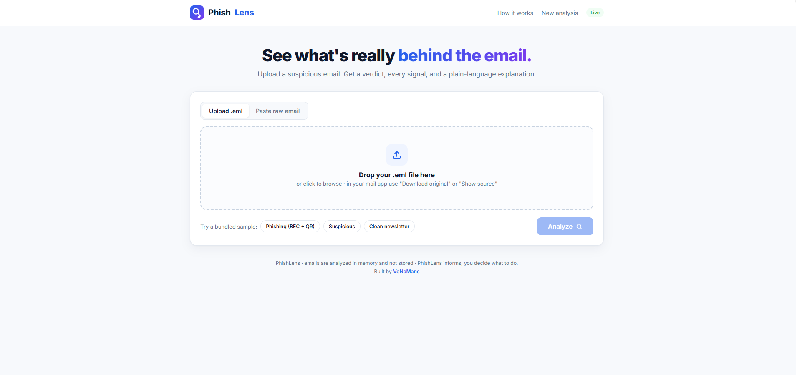
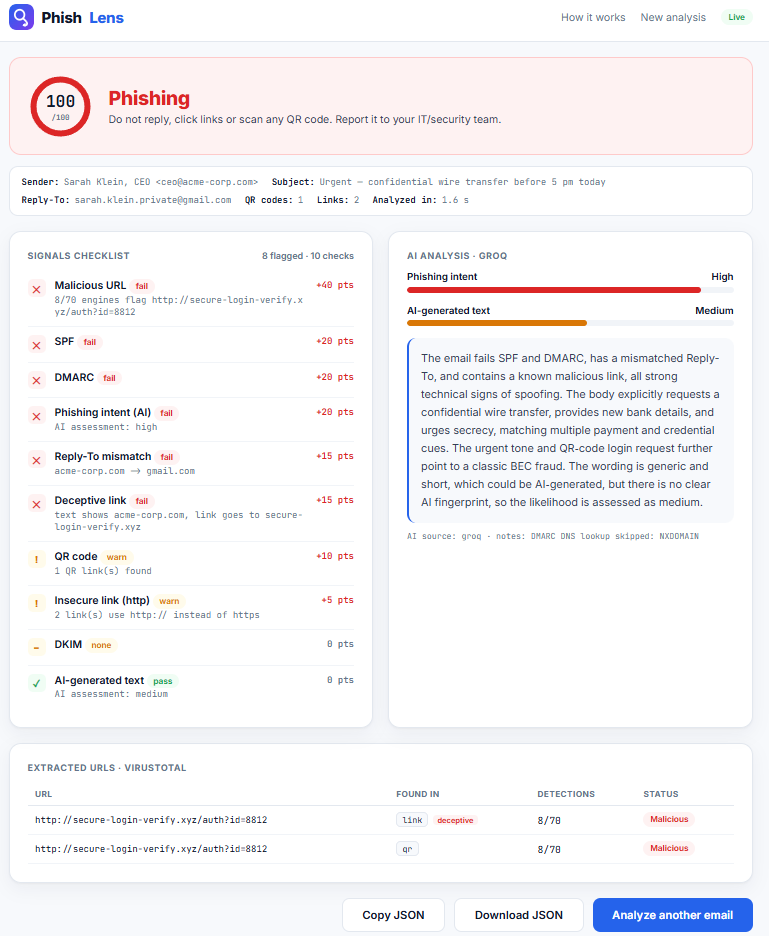
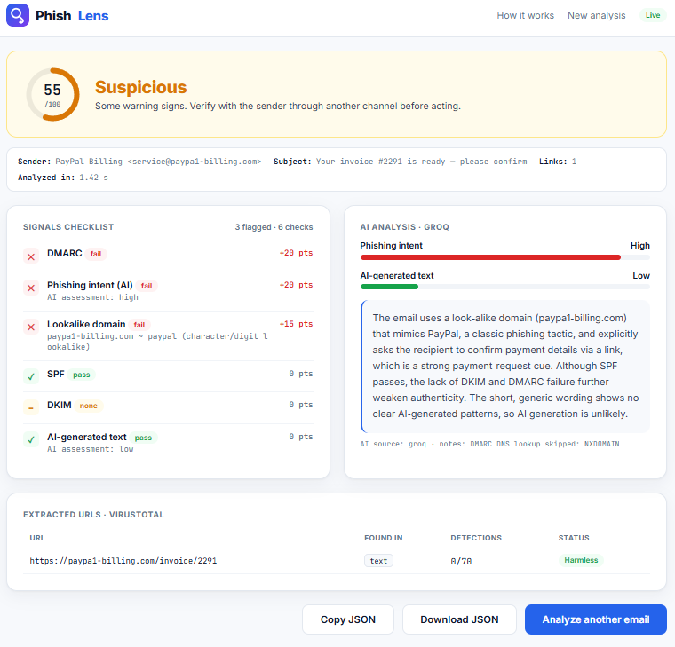
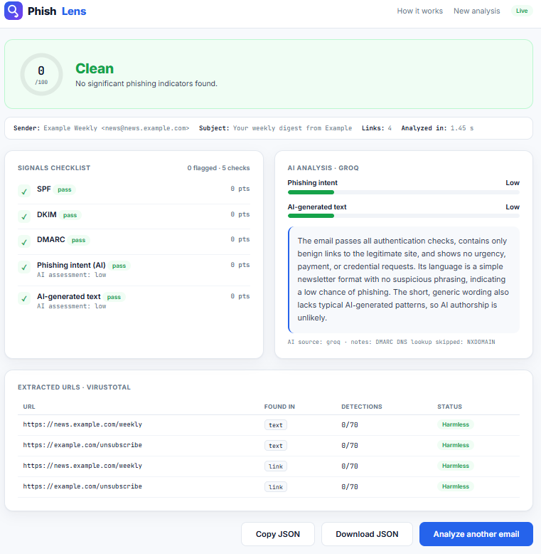

# PhishLens — Email Phishing Forensic Analyzer

## Overview
A forensic email-analysis tool that inspects a single suspicious email and returns an explainable verdict — Phishing, Suspicious, or Clean — with every signal and its weight shown. The user uploads an `.eml` file (or pastes the raw email); PhishLens checks the technical evidence first (SPF/DKIM/DMARC authentication, link reputation, deceptive and lookalike domains, QR codes), then an LLM reasons over that structured evidence and explains it in plain language. It is an on-demand analyzer — one email at a time, like a malware sandbox for emails — not a mailbox monitor or spam filter: it informs, the user decides. The whole project runs from a single hardened Docker image; a teammate needs only Docker and their own two free API keys.

## Architecture

| Component       | Detail                                                                       |
|-----------------|------------------------------------------------------------------------------|
| Web server      | FastAPI + Uvicorn, served on port 8000 (`GET /`, `POST /analyze`, `/health`) |
| Core engine     | Pure-Python "brain" (`app/core`) — one analyzer, called by web and CLI       |
| Email parsing   | Python standard-library `email` module (headers, body, inline images)        |
| Authentication  | `dkimpy` (DKIM re-verify) + `dnspython` (SPF/DMARC DNS lookups)              |
| QR decoding     | `pyzbar` + `Pillow`, backed by the native `libzbar0` library                 |
| URL reputation  | VirusTotal API v3 (~70 engines), cached in SQLite, rate-limited              |
| AI reasoning    | Groq API, model `openai/gpt-oss-120b`, reasons over the evidence             |
| Front end       | HTML + CSS + vanilla JavaScript, no build step                               |
| Container       | Docker + docker-compose; non-root, read-only rootfs, cache on a volume       |

One brain (`app/core/analyzer.py`) runs six steps in order; two doors — the web page and the CLI — call it, so no logic is duplicated. Emails are analyzed in memory and never stored. The pipeline is: **parse → headers → extract (URLs + QR) → VirusTotal → AI reasoning → score**.

## Features
- Explainable verdict (Phishing / Suspicious / Clean) with a 0–100 score and a per-signal breakdown
- Sender-authentication checks: SPF, DKIM (re-verified), DMARC (with live policy lookup)
- Impersonation detection: Reply-To mismatch, display-name spoofing, lookalike sender and link domains (homoglyph/typo aware)
- Link analysis: VirusTotal reputation, deceptive links (text != href), insecure `http://` links
- QR-code phishing (quishing) detection — decodes URLs hidden in images that text scanners miss
- LLM reasoning over structured evidence: phishing-intent and AI-generated-text assessment with a plain-language explanation
- Live six-stage pipeline view; JSON report export (copy/download)
- CLI with the same engine (exit code encodes the verdict) and a precision/recall evaluation harness
- Graceful degradation: runs without keys (technical signals work; AI falls back to an offline estimate)

## Tools Used
- Python 3.11+
- FastAPI + Uvicorn
- dkimpy, dnspython
- pyzbar + Pillow (libzbar0)
- VirusTotal API v3
- Groq API (`openai/gpt-oss-120b`)
- SQLite
- Docker + docker-compose

## Detection Signals

| Signal                | Detects                                                        | Weight |
|-----------------------|----------------------------------------------------------------|--------|
| Malicious URL         | A link flagged malicious by VirusTotal engines                 | +40    |
| SPF fail/softfail     | Sending server not authorized by the domain                   | +20    |
| DMARC fail            | Visible From domain not aligned with SPF/DKIM                 | +20    |
| Phishing intent (AI)  | LLM assesses social-engineering intent high (medium = +10)    | +20    |
| DKIM fail             | Invalid signature / tampered message                          | +15    |
| Reply-To mismatch     | Replies go to a different domain than the sender              | +15    |
| Lookalike sender      | Sender domain imitates a brand (`paypa1` → paypal)            | +15    |
| Deceptive link        | Visible link text differs from the real href                 | +15    |
| Lookalike link        | A link domain imitates a brand (`mlcrosoftonline`)           | +15    |
| Display-name spoofing | Display name imitates a brand or executive, domain unrelated | +10    |
| QR code               | A QR image decodes to a URL (quishing)                       | +10    |
| Insecure link (http)  | A link uses `http://` instead of `https`                     | +5     |
| AI-generated text     | Text statistically likely written by an AI                   | +5     |

## Scoring

| Score  | Verdict    |
|--------|------------|
| 60–100 | Phishing   |
| 30–59  | Suspicious |
| 0–29   | Clean      |

Points from every fired signal sum (capped at 100). No single signal decides the verdict — several must stack — which keeps a lone quirk (e.g. a forwarded email with broken DKIM) from being called phishing. The AI is one voice among several and never the sole judge; the AI-generated-text signal is deliberately the weakest (+5) because AI-text detection is unreliable.

## Setup Guide

### Prerequisites
- Docker Desktop (or Docker Engine + compose)
- Two free API keys:
  - Groq — https://console.groq.com/keys
  - VirusTotal — https://www.virustotal.com/gui/my-apikey

### 1. Configure API keys
Copy the template and add your own keys. The real `.env` is git-ignored and docker-ignored, so keys are never committed or baked into the image.
```bash
cp .env.example .env      # Windows: copy .env.example .env
# edit .env:
#   GROQ_API_KEY=gsk_your_key
#   VT_API_KEY=your_virustotal_key
```

### 2. Build and run
```bash
docker compose up --build
```
The image bundles the native `libzbar0` library and all dependencies, so nothing else needs installing. Open http://localhost:8000. To stop: `Ctrl+C`, then `docker compose down`.

To change a key later, edit `.env` and recreate the container (keys are read at start-up):
```bash
docker compose up -d --force-recreate
```

### 3. Command line (same engine)
```bash
python analyze.py tests/samples/phishing_bec_qr.eml       # pretty report
python analyze.py some_email.eml --json                   # JSON only
cat some_email.eml | python analyze.py -                  # from stdin
# exit code: 0 clean, 1 suspicious, 2 phishing

# inside Docker:
docker compose run --rm phishlens python analyze.py tests/samples/phishing_bec_qr.eml
```

### 4. Run without Docker (optional)
Requires Python 3.11+ and the native `zbar` library (`apt install libzbar0` / `brew install zbar`).
```bash
pip install -r requirements.txt
cp .env.example .env
uvicorn app.web.main:app --reload
```

## Evaluation
An evaluation harness measures precision/recall against a labelled corpus and prints a confusion matrix:
```bash
python eval/evaluate.py
# 3 emails: phishing 95, suspicious 55, clean 0 — 100% precision/recall
```
Three synthetic samples ship in `tests/samples/` (one phishing with a real QR code, one suspicious lookalike, one clean newsletter). Grow the set with the Nazario phishing corpus for phishing and your own newsletters/receipts (exported as `.eml`) for clean, adding rows to `eval/labels.csv`. Regenerate the samples with `python tests/make_samples.py` (requires `pip install qrcode`).

## Project Structure
```
phishlens/
├── app/
│   ├── config.py            # loads API keys + settings from .env
│   ├── core/                # the brain (pure Python)
│   │   ├── analyzer.py      # conductor: steps 1–6
│   │   ├── parser.py        # parse .eml
│   │   ├── headers.py       # SPF/DKIM/DMARC, reply-to, spoofing, lookalike
│   │   ├── brands.py        # brand / typo / homoglyph matching
│   │   ├── extractor.py     # URLs + QR; deceptive / lookalike / insecure flags
│   │   ├── cache.py         # SQLite cache for VirusTotal
│   │   ├── virustotal.py    # URL reputation
│   │   ├── llm.py           # Groq reasoning (+ offline fallback)
│   │   └── scoring.py       # points → verdict
│   └── web/                 # the website door
│       ├── main.py          # FastAPI routes
│       ├── templates/index.html
│       └── static/style.css, app.js, logo.svg
├── analyze.py               # the CLI door
├── tests/                   # make_samples.py + samples/*.eml
├── eval/                    # evaluate.py + labels.csv
├── Dockerfile               # self-contained image (bundles zbar)
├── docker-compose.yml       # one-command run; mounts .env; persists cache
├── .env.example             # copy to .env and add your keys
├── requirements.txt
└── screenshots/
```

## Security & Privacy
- Non-root container, read-only root filesystem, `no-new-privileges`, upload size cap, cache on a writable volume.
- Secrets live only in a local `.env`, excluded from Git and the Docker image.
- Emails are analyzed in memory and not stored. Only URLs are sent to VirusTotal; only signals and body text are sent to Groq.

## Limits
- A brand-new phishing URL may be unknown to VirusTotal — other signals cover this case.
- Forwarding can break DKIM on legitimate mail.
- AI-generated-text detection is unreliable and never decides the verdict alone.
- With no headers supplied (pasting body text only), SPF/DKIM/DMARC read as unknown and score 0 — feed the raw `.eml` ("Show original" / "View source") for full accuracy.

## Screenshots

**Interface Overview**


**Phishing Verdict**


**Suspicious Verdict**


**Clean Verdict**


## Author
Mohamed Abdelli
